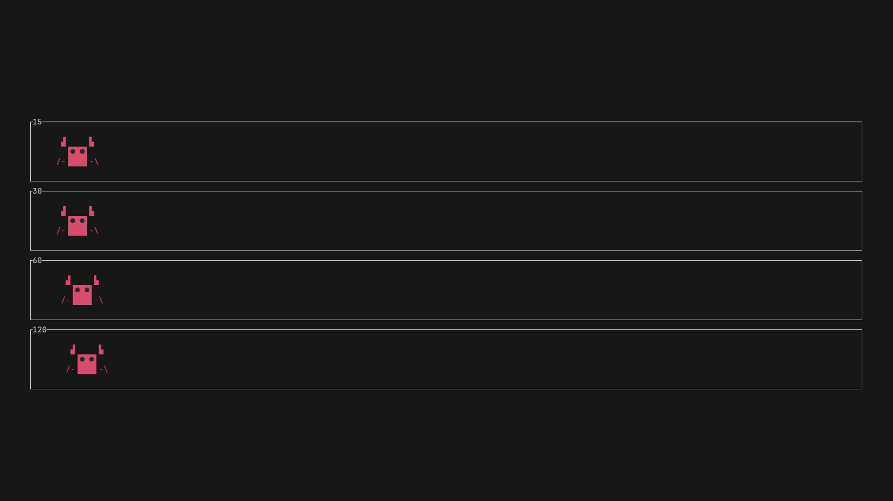

# Ateshi (あてぃしガニ)

ateshi is a Command Line Interface (CLI) tool designed to mimic the functionality of UFO Test.



## Features

- Run UFO Test-like tests in a command-line interface

## Installation

You can install `ateshi` using Cargo, the Rust package manager:

```
cargo install ateshi
```

Make sure you have Rust and Cargo installed on your system. If you don't have them installed, you can get them from [https://www.rust-lang.org/](https://www.rust-lang.org/).

## Usage

To use `ateshi`, run the command followed by four numbers. Each number represents a frame rate (fps) to be displayed, with a maximum value of 240 for each number.

```
ateshi <fps1> <fps2> <fps3> <fps4>
```

Example:

```
ateshi 30 60 120 240
```

This command will run the test displaying frame rates of 30, 60, 120, and 240 fps.

Note: If you enter a value greater than 240, it will be capped at 240.

## Name Origin

The name `ateshi` comes from an interesting internet meme. It's derived from the Japanese phrase `あてぃしガニ` (Ateshi gani), which is a meme associated with a legendary maid VTuber. This name adds a touch of humor and uniqueness to the project.

## Contributing

Contributions are welcome! Feel free to submit pull requests, report bugs, suggest features. Every contribution, no matter how small, is valued and appreciated.

## License

MIT

## Special Thanks

[Aqua Minato (湊あくあ)](https://www.youtube.com/channel/UC1opHUrw8rvnsadT-iGp7Cg): A legendary maid VTuber who created wonderful memories that inspired this project.
[@mkft](https://github.com/mkft): For proposing and testing this project.
